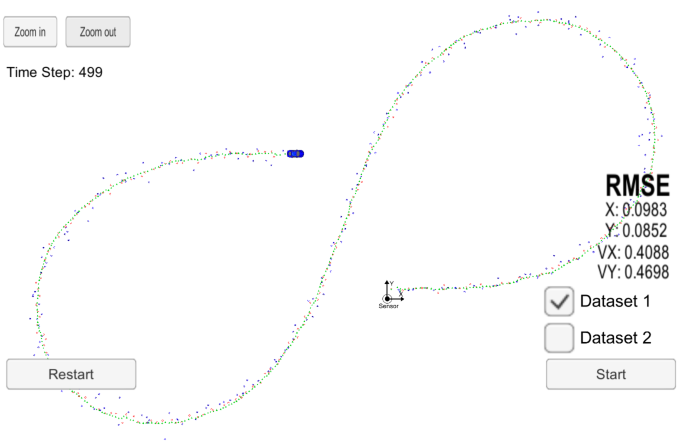

# Extented Kalman Filter

In this project, I implemented an __Extended Kalman Filter__ in C++ that receives Lidar and Radar input data to estimate an object's position and velocity in the plane.

My submissions includes the following files:

- __kalman_filter.cpp__: Implementation of the prediction step, the Kalman Update step for Lidar data, and the Extended Update step for Radar data (nonlinear transformation of the data into the measurement space and performing a Kalman Update with the linear approximation of that transformation, i.e., its Jacobian matrix).
- __FusionEKF.cpp__:Initialization of process and measurement noises. Update of the process noise covariance matrix.
- __tools.cpp__: Calculation of the root mean squared error compared to the ground truth. Functions that calculates the Jacobian matrix.

## Project Specifications

In the following, I will address all rubric points.

### Compiling

My operating system is Windows 10. I used _Bash on Ubuntu on Windows_. All coding was done in C++. The code compliles without errors.

### Accuracy

To meet the specifications, the RMSE of [px, py,vx, vy] must be lower or equal to [.11, .11, .52, .52] on the first dataset. The following table shows my results:

| Used sensors | Dataset | RMSE |
| :------------: | :-------: | ----: |
| both | 1 | .098 .085 .409 .47 |
| lidar | 1 | .098 .085 .41 .47 |
| radar | 1 | .095 .087 .37 .47 |
|both | 2 | .073 .097 .449 .464 |
| lidar | 2 | .078 .099 .5 .484 |
| radar | 2 | .073 .097 .45 .464 |

### Correct Algorithm

I implemented the Extended Kalman filter in the .cpp files mentioned above. In particular, I implemented the initialization and the update steps for both sensors.

### Code Efficiency

For all calculations, I stored all values that are reused in separate variables. This increases the memory amount used but the speed of the algorithm benefits. This is important since these algorithms have to run in real-time.

## Discussion

From both datasets we can see that one sensor seems to be enough be achieve good results. All experiments showed similar results with the radar sensor giving slightly better measurements than the lidar data.
